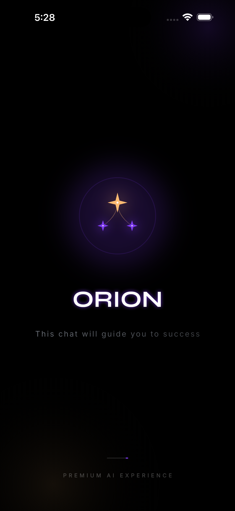
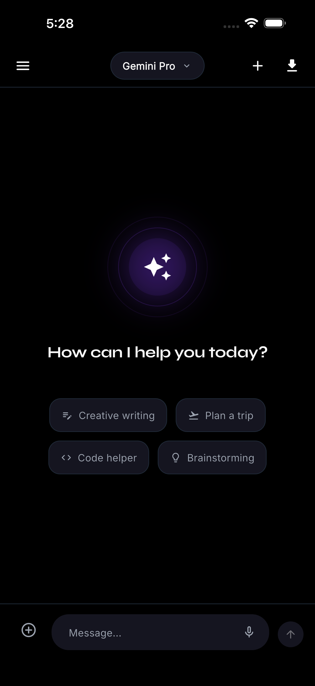
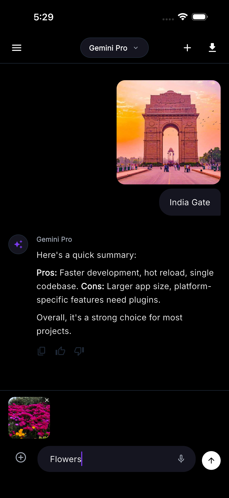
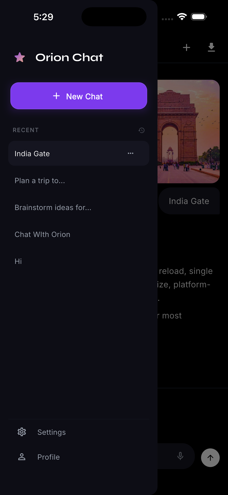

# Orion AI Chat Interface

This repository contains my submission for the Avyxon AI Labs Technical Challenge 2026. The project, named Orion, is a high-end AI chat application built with Flutter that focuses on premium user experience, clean architecture, and standard mobile development practices.

## Visual Walkthrough

### App Demo

[Click here to watch the Orion AI Walkthrough](https://drive.google.com/file/d/1yXzXXlt3YDVZ43j4DixTHCPSl2_LguYH/view?usp=sharing)

  

### Interface Screenshots

  
  
  
  

## Project Overview

Orion is designed to provide a sophisticated chat experience. Beyond the core requirements of the challenge, it features a custom AMOLED dark theme, specialized typography using the Syne font for branding, and professional-grade UI elements like an animated constellation splash screen and a persistent model selector.

## Core Features

- **Interactive Chat Interface**: Clean and responsive message bubbles for both users and the AI with Markdown support.
- **Model Switching**: Ability to switch between multiple AI models (Gemini Pro, Ultra, Claude 3) within the same chat session.
- **Chat Management**: Full CRUD support for chat sessions, including starting new chats, renaming, and deleting history.
- **PDF Export**: Branded PDF download feature to save and share chat conversations in a professional dark-themed format.
- **UX Polish**: Smart auto-scrolling, smoothed transitions, and custom-painted branding (Constellation Logo).
- **Multimedia Support**: Prototypes for image attachment and voice-to-text input within the chat flow.

## Technical Stack

- Framework: Latest Flutter Stable
- State Management: Provider
- Theme: Material 3 (Custom Royal & Premium AMOLED Dark)
- Typography: Syne (Branding) and Inter (Body)
- Persistence: Local storage for chat sessions and history.

---

## Challenge Questions

### 1. Why did you choose this challenge?

I chose the AI Chat Interface challenge because I've always wanted to build a system where users can seamlessly switch between different AI models within the same conversation. This challenge presented the perfect opportunity for me to implement that logic. I feel that giving users the power to choose their model for each specific response is a key part of a "pro" AI experience, and I wanted to see how I could handle that state transition smoothly in Flutter.

### 2. What architecture / state management did you use and why?

I used the Provider package for state management combined with a modular folder structure (models, providers, screens, services, widgets). Provider was chosen for its balance of readability and power. It allowed me to keep the business logic of state transitions—like the AI typing indicator and the scrolling logic—decoupled from the UI, ensuring that the codebase remains maintainable and easy to follow for other developers.

### 3. If this app scaled to 100K users, what would you improve?

If Orion were to scale to 100K users, I would implement several optimizations:

- Database: Transition from basic local storage to a more robust solution like Hive or an offline-first sync with Firebase or Supabase.
- Performance: Implement pagination (Lazy Loading) for message history to ensure the UI remains smooth even with thousands of messages.
- Real AI: Replace the mock service with a real-time streaming API (WebSockets or Server-Sent Events) to provide tokens as they are generated.
- Backend Logic: Move some of the heavier data processing and model orchestration to a robust backend using Node.js or Python to keep the mobile app lightweight.

### 4. Why do you want to intern at Avyxon AI Labs?

I am currently in my 3rd year and have around 2 years of experience in Flutter development. Throughout my previous internships and projects, I have worked on many data-driven apps, but I’ve always been fascinated by AI and wanted to pivot into this space. I find the opportunity at Avyxon specifically fascinating because it allows me to combine my solid foundation in app development with the cutting-edge potential of AI-first products.

### 5. What are you hoping to learn in the next 6 months?

In the next 6 months, my primary goal is to dive deep into AI architecture and understand the underlying mechanics of how these systems integrate with mobile platforms. I also want to learn how to build deep UI/UX trust with users—ensuring that AI interactions feel safe and intuitive—and most importantly, I want to develop a true "production-ready" mindset by learning how to ship high-quality, scalable code at a professional level.

---

## Getting Started

1. Ensure you have the latest Flutter Stable installed.
2. Clone the repository and navigate to the project directory.
3. Run `flutter pub get` to install dependencies.
4. Run `flutter run` on your preferred emulator or device.
