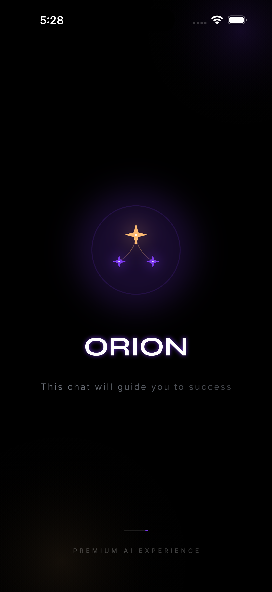
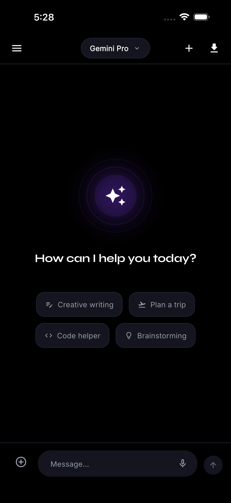
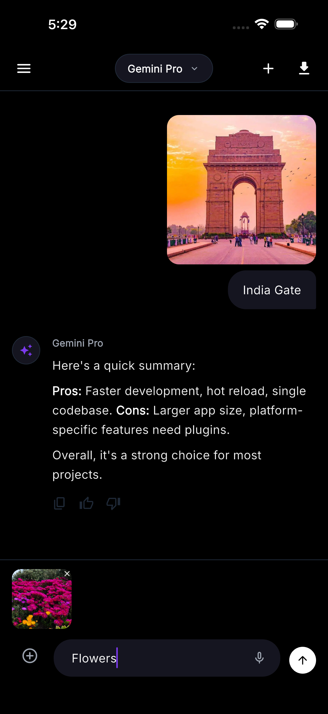
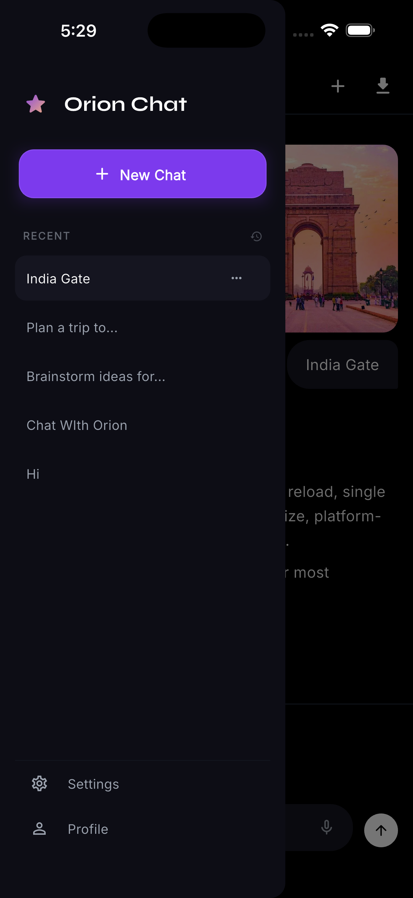

# 🌌 Orion AI | Premium Chat Interface

Orion is a high-fidelity AI chat application designed for a sophisticated and seamless user experience. Built with **Flutter**, it prioritizes clean architecture, premium aesthetics, and professional-grade mobile development practices.

<p align="center">
  
  
  
  
</p>

---

## ✨ Key Highlights

- **🎯 Multi-Model Orchestration**: Seamlessly switch between different AI models (Gemini Pro, Ultra, Claude 3) within a single conversation thread.
- **🎨 Premium AMOLED Design**: A custom-crafted dark theme optimized for OLED displays, featuring specialized typography using the **Syne** font.
- **📄 Professional PDF Export**: Generate branded, dark-themed PDF reports of your conversations for easy sharing and documentation.
- **🏗️ Clean Architecture**: Built with a modular folder structure and robust state management for scalability and maintainability.
- **⚡ UX Polish**: Features animated constellation splash screens, smart auto-scrolling, and Markdown support for rich text rendering.
- **🛠️ Persistence**: Local storage integration for full CRUD support of chat sessions and history.

---

## 🚀 Technical Stack

- **Framework**: Flutter (Stable)
- **State Management**: Provider
- **Design System**: Material 3 (Custom Premium Theme)
- **Typography**: Syne (Branding) & Inter (Body)
- **Features**: Markdown Parsing, PDF Generation, Local Database

---

## 🛠️ Getting Started

To run Orion locally on your machine, follow these steps:

1. **Prerequisites**: Ensure you have the latest [Flutter SDK](https://docs.flutter.dev/get-started/install) installed.
2. **Clone**: 
   ```bash
   git clone https://github.com/maisachinsharmahu/orion-chat-app.git
   ```
3. **Dependencies**: 
   ```bash
   flutter pub get
   ```
4. **Run**: 
   ```bash
   flutter run
   ```

---

## 📺 Walkthrough
[Watch the Orion AI Demonstration](https://drive.google.com/file/d/1yXzXXlt3YDVZ43j4DixTHCPSl2_LguYH/view?usp=sharing)

---
<p align="center">Built with ❤️ for a superior AI experience.</p>
